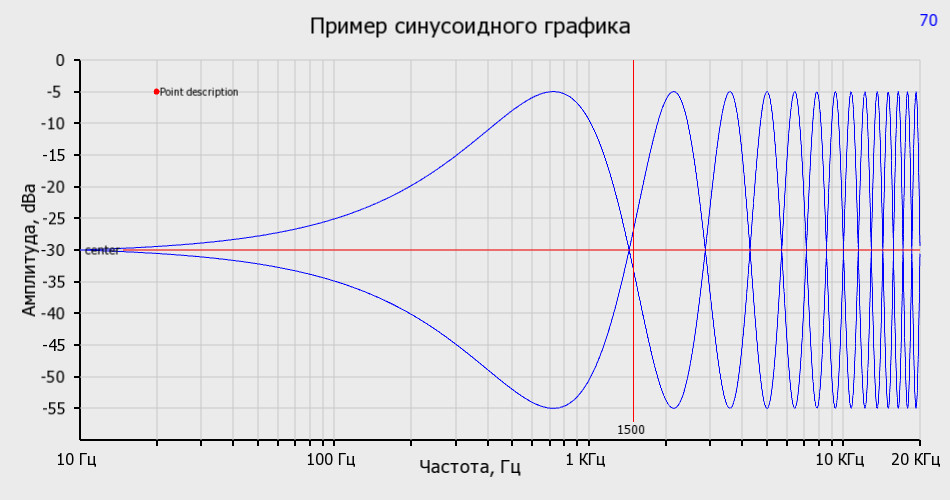

# Sfgr
 Класс для рисования графиков АЧХ слышимого звукового диапазона<br>
 Используется библиотека <a href="https://www.sfml-dev.org/index.php">SFML</a>, и для корректной работы она должна быть правильно <a href="https://www.sfml-dev.org/tutorials/2.5/">установлена</a>.<br>
 По оси X используется логарифмическая шкала, по оси Y используется линейная (предполагается, что логарифмическими будут ее значения).
 ### Порядок использования:
 1. Подключить библиотеку SFML, нужные компоненты: sfml-graphics, sfml-window, sfml-system. Не забыть скопировать ее .dll'и в каталог c exe-файлом.
 2. Создать экземпляр класса Sfgr: ``` Sfgr graph;```
 3. Произвести необходимые настройки конфигурации: ```graph.cfg.Title=L"Заголовок"; graph.cfg.XDimMax=15000;``` etc
 4. Произвести дальнейшие автонастройки и запустить оконный тред: ```graph.Start();``` (выход - q, снимок - PageDown)
 5. Ввести константу размера массива под графики: ```const int GraphSize = graph.cfg.XDimMax-graph.cfg.XDimMin;```
 6. Создать кадр для рисования на области графика: ```Frame* f = graph.NewFrame(GraphSize);```
 8. Рисовать графики:
 ```c
 f->ArrayGraph.clear();           // Очищаем график
 f->GraphColor = sf::Color::Red;  // Устанавливаем цвет графика
 for (int i=0; i<GraphSize; ++i)  // В цикле добавляем точки графика
 {
  Sfgr::point pnt;                 // Точка это структура из 2 float: XValue и YValue
  pnt.XValue = graph.cfg.XDimMin + i;
  pnt.YValue = function(...);
  { // Заполняем массив данными Xvalue и YValue }
  f->ArrayGraph.push_pack(pnt); 
 }
 ```
 Примечание: рисование начинается с минимального значения по X и не более 1 графика на кадр.<br>
 Кадров может быть сколько угодно.<br>
 7. Опубликовать слой ```f``` на отображаемом окне: ```graph.ShowFrame(f);```<br>
 8. Удалить слой из окна (перед публикацией следующего кадра): ```graph.DeleteFrame(f);```<br>
 9. Можно так же рисовать точки: ```f->AddPoint(20, -40, 3, sf::Color::Red, L"Метка", 16);```<br>
 10. И линии:<br>
 ```
 f->AddHLine(-30, 1, sf::Color::Red, L"порог", 14);
 f->AddVLine(1000, 1, sf::Color::Red, L"1КГц", 14);
 ```
 11. Можно делать снимки кнопкой PageDown (если задан каталог куда их класть ```graph.cfg.ScrShotDir="c:\\results";```)
 
 Живой пример можно посмотреть в main.cpp<br>
 
